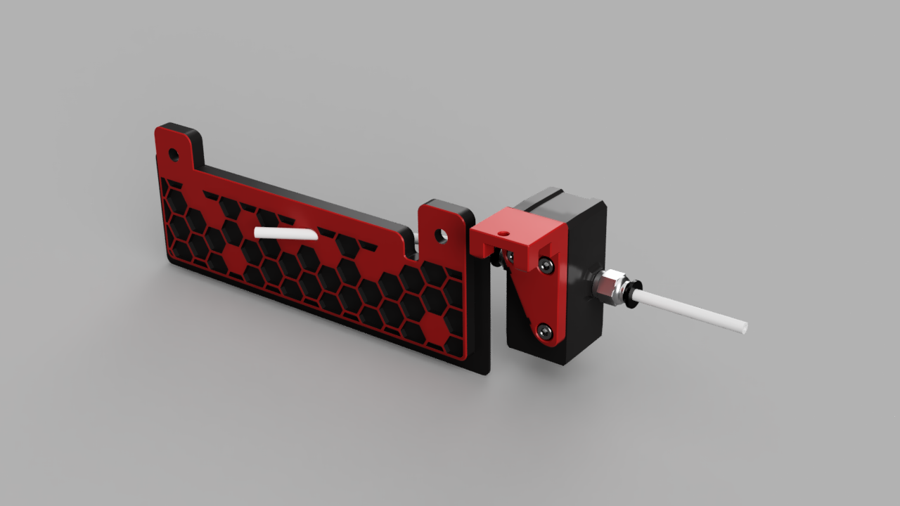

# BTT-SFS2 Mount

A Mount for the BigTreeTech Smart Filament Detection Module V2.0 for Voron 2 and Trident.

# Printing

Choose the correct STL files according to the thickness of your rear panel + foam.
(for a 3mm panel, w/ 1mm foam, use the _4mm STLs)

If you need a custom size, there is a [parametric cad file](CAD/BTT-SFS2_Mount_Parametric.f3d) included.

STLs are already oriented correctly for printing, as shown below.

